# 数据结构ppt笔记

[TOC]

## chap1 序言

#### 用模版实现一个线性表

```c++
template<class type>
class List{
private:
    Type *Element;
    int size;
public:
    List(int s = 10):size(s),Element(new type[s]){} //构造函数
    ～List(){delete []Element;}//析构函数
}

int main(){
    const int size = 10;
    List<int> list(size);//实例化一个线性表
}
```

## chap2 数组

#### 顺序表的声明

```c++
template <class Type>
class SeqList{
private:
    Type *data;
    int maxSize;
    int last;
public:
    SeqList(int size):maxSize(size),data(new Type[size]){}
    ~SeqList(){delete [] data;}
    int Length()const{return last+1;}
    int IsEmpty(){return last==-1;}
    int IsFull(){return last = maxSize-1;}
}
template<class Type>
SeqList<Type>::SeqList(int sz){//构造函数
    if(sz>0){
        maxSize = sz;
        last = -1;
        data = new Type[maxSize];
    }
}
```

#### KMP算法


k如果小，那么模式串往右移动的步数变多，就可能失去可能的匹配

## chap3 链表

#### 链表类定义

```c++
template<class Type>
class ListNode{
    friend class List;
private:
    Type data;
    ListNode *link;
public:
    ListNode(Type d,ListNode *l = NULL):data(d),link(l){};
}
class List{
private:
    ListNode *first;
}
```

#### 链表为空

* 不带头结点的单链表

  First == NULL

* 带头结点的单链表为空

  first -- > link == NULL

* 不带头结点的循环链表

  First == NULL

* 带头结点的循环链表

  First --> link = first

* 带有表头结点的双向链表

  First -> llink = first && first ->rlink = first


#### 用循环链表求解约瑟夫问题

约瑟夫问题:实际上是一个游戏。书中以旅行社从n个旅客中选出一名旅客，为他提供免费环球旅行服务。 n=8，m=3(报数)从1号开始报数出列顺序为:3，6，1，5，2， 8，4。最后一个编号7的旅客将赢得环球旅游。 

```c++
template<class Type>
void CircList<Type>::Josephus(int n,int m){
    LinkNode *pre = NULL;
    LinkNode *p = first;
    for(int i = 0;i<n-1;i++){
        for(int j = 0;j<m-1;j++){
            pre = p;
            p = p->link;
        }
        pre->link = p->link;
        cout<<p->data;
        free(p);
        p = p->link;
    }
    cout<<"result is :"<<p->data;
}
```

#### 多项式相加

```c++
struct Term{
    int coef;
    int exp;
    void Init(int c,int e){coef = c,exp = e}
}
class Polynomial{
private:
    Link<Trem> *first;
public:
    friend Polynomial operator+(const Polynomial &,const Polynomial &);
}
Polynomial operator+(const Polynomial & a,const Polynomial&b){
    LinkNode<Term> * pa;//a的工作指针
    LinkNode<Term> * pb;//b的工作指针
    LinkNode<Term> * pc;//指向结果串
    LinkNode<Term> * p;//临时指针，用来删除结点
    pa = a->first->link;
    pb = b->first->link;
    delete b->first;
    while(pa!=NULL || pb!=NULL){
        if(pa->exp == pb->exp){
            pa->coef += pb->coef;
            p = pb;
            pb = pb->link;
            delete p;
            if(pa->coef == 0){
                p = pa;
                pa = pa->link;
                delete p;
            }else{
                pc->link = pa;
                pc = pa;
                pa = pa->link;
            }
        }else if(pa->exp < pb->exp){
            pc->link = pb;
            pc = pb;
            pb = pb->link;
        }else{
            pc->link = pa;
            pc = pa;
            pa = pa->link;
        }
        //最后还有剩余的链
        if(pa!=NULL){
            pc->link = pa;
        }else{
            pc->link = pb;
        }
    }
}
//复杂度 O(m+n)
```

#### 稀疏矩阵（⌛️）

## 栈和队列

#### 顺序栈的类定义

```c++
template class<Type>
class Stack{
private:
    int top;
    Type* Elements;
    int maxSize;
public:
    Stack(int s = 10):maxSize(s),top(-1){//top初始化为-1，top 代表栈顶元素的位置
        Elements = new Type[maxSize];
        assert(Element!=0) //契约式编程 😄
    }
    ~Stack(){delete []Elements;}
    Type pop();
    Type getTop();
    void push(const Type &item);
    void clear(){top = -1;}
    int isEmpty()const{ return top == -1;}
    int isFull()const{return top = maxSize-1;}
}
void Stack<Type>::push(const Type &item){
    assert(!isFull());
    Element[++top] = item; // 先++，再赋值
}
int Stack<Type>::pop(){
    assert(!isEmpty());
    return Element[top--];//先return结果，再减减
}
//STL里面的pop是只删除栈顶结点，不返回栈顶结点值
//获取栈顶结点，需要getTop()
//但ppt里写的是：pop会返回栈顶结点
Type Stack<Type>::getTop(){
    assert(!isEmpty());
    return Element[top];
}
```

#### 链式栈

插入删除都在栈顶：头结点

```c++

```

#### 队列

* 约定：front指向实际队头元素的前一个位置   
* rear 指向实际的队尾元素
* rear - front = 队中元素的个数。 
* 队列为空：front = rear = -1
* 插入：rear + +
* 删除：front++

#### 循环队列

* front 指向实际队头元素的前一个位置   
* rear 指向实际的队尾元素
* 队空：rear = front
* 队满：(rear+1+)%maxSize = front
* 队列元素数：(rear - front + maxSize)%maxSize

#### 链式队列

表头 --- 队头 --- 删除

表尾 --- 队尾 --- 插入

#### 打印杨辉三角（二项式系数）

```c++
void yanghui(int n){
    Queue<int>q;
    q.clear();
    q.push(1);
    q.push(1);
    int s = 0;
    for(int i=1;i<=n;i++){//逐行处理,第ℹ️行
        cout<<endl;
        for(int k = 1;k<=10-i;k++)cout<<" ";
        q.push(0);
        for(int j = 1;j<=i+2;j++){第ℹ️行共i+1个数（包括0⃣️）
            int t = q.pop();
            q.push(s+t);
            s = t;
            if(j!=i+2)cout<<s<<" ";
        }
    }
}
```

#### 优先队列-数组实现

每次取出优先级最高的元素

遍历找到优先级最高的元素，将它return，并用数组最后一个元素填充它的位置，最后数组长度 -1

## chap5 递归

#### 汉诺塔问题

#### 广义表


n(n>=0)个表元素a0 , a1, a2,......an-1组成的有限序列。记作: 

LS=(a0 , a1, a2,......an-1) 其中每个表元素ai可以是原子,也可以是子表。 


#### 广义表类

```c++
class GenListNode{
    private:
    	int tag;
    	GenListNode *tlink;
    	Union{
            int data;
            GenListNode *hlink;
        }value;
   	public:
    	...
}
class GenList{
    
}

//tag = 1 ， 是子表结点  此时 value 存储 子表结点的表头指针
//tag = 0 ， 是原子结点  此时 value 存储 原子结点值
```

#### 判断a是否属于广义表

```C++
int member(GenListNode *L,int a){
    int check = 0;
    GenListNode *ptr = L;
    while(ptr!=NULL&!check){
        if(ptr->tag == 1){//如果当前结点是子表，则递归判断子表
            check = member(ptr->value.hlink,a);
            if(check == 0)ptr = ptr->tlink;//如果子表中没有a，则继续往后移动
        }else if(ptr->value.data == a){//如果当前结点是原子结点，则判断是否相等
            check = 1;
        }else{//如果是原子结点，但不等于a，则继续往后移动
            ptr = ptr->tlink;
        }
    }
    return check;
}
```

## chap6 树和森林

#### 根的层数为0 


* 二叉树第i层上至多有$2^i$个结点 
* 深度为k的二叉树至多有$2^{k+1}-1$个结点(k>= -1) 

## chap7 集合与搜索

####  位向量实现集合

```c++

```

####  链表实现集合


#### 并查集

复杂度：

Union: O(1)

find : O(n)

##### 改进方法：

######  1. 按树的结点数合并

结点少的树合并到结点多的树上

```c++
//root1 , root2 是根结点
void UFSets::WeightedUnion(int root1, int root2){
	int temp = parent[root1] + parent[root2];
    if(parent[root2]<parent[root1]){
        parent[root2] = temp;
        parent[root1] = parent[root2];
    }else{
        parent[root1] = temp;
        parent[root2] = parent[root1];
    }
}
//root1,root2不是根结点
void UFSets::WeightedUnion(int root1,int root2){
    int i = find(root1);
    int j = find(root2);
    if(i!=j){
        int temp = parent[i]+parent[j];
        if(parent[i]<parent[j]){
            parent[i] = temp;
            parent[j] = parent[i];
        }else{
            parent[j] = temp;
            parent[i] = parent[j];
        }
    }
}
```


此种策略下，树的深度一般不超过 $log_2 n$


######  2. 按树的高度合并

高的树的根作为根结点

```c++

```

###### 3. 压缩元素的路径长度

```c++
int CollapsingFind(int i){
 	int r,temp;
    r = parent[i];
    while(r>=0)r = parent[r];
    while(i!=r){
        temp = parent[i];//暂存结点ℹ️的父结点
        parent[i] = r;
        i = temp;//ℹ️向上移动
    }
}
```


####  散列

##### 散列函数

###### 1. 直接定址法

###### 2. 数字分析法

###### 3. 除留余数法


###### 4. 平方取中法

###### 5. 折叠法

1. 移位法
2. 分界法/折叠法


#####  解决冲突的方法

###### 1. 闭散列法（开地址法）

1. 线性探测法

2. 二次探测法/平方探测法

   

3. 双散列法

   

######  2. 开散列法（链地址法）

## chap8 搜索结构

#### 二叉搜索树的类定义

```c++
template class<Type>
class BSTNode:public BinaryTreeNode{
    friend class BST;
    protected:
    	Type data;
    	BSTNode<Type> *leftChild,rightChild;
    public:
    	BSTNode():leftChild(NULL),rightChild(NULL){}
    	BSTNode(const Type d,BSTNode<Type>*left = NULL,BSTNode<Type>*right = NULL):data(d),leftChild(left),rightChild(right){}
    	void setData(Type d){
            data = d;
        }
    	Type getData(){return data;}
    	~BSTNode(){}
}
class BST:public BinaryTree{
    private:
    	BSTNode<Type> *root;
    	Type RefValue;//数据输入停止的标志
    	void makeEmpty(BSTNode<Type>*&root);
    	void insert(Type x,BSTNode<Type>*&ptr);
    	....
            
}
```

#### 搜索算法

```c++
//递归
BSTNode<Type> BST<Type>::Find(Type x,BSTNode<Type>*root){
    if(root == NULL )return NULL;
    if(root->data == x)return root;
    else if(root->data > x)return Find(x,root->leftChild);
    else return Find(x,root->rightChild);
}

//非递归
BSTNode<Type> BST<Type>::Find(Type x,BSTNode<Type> *root){
    if(root == NULL)return NULL;
    BSTNode<Type> *p = root;
    while(p!=NULL){
        if(p->data == x){
            return p;
        }else if(p->data > x){
            p = p->leftChild;
        }else{
            p = p->rightChild;
        }
    }
}
```


####  插入

⚠️插入一个元素之前要先检查这个元素是否已经存在

```c++
//递归
template <class Type> 
void BST<Type>::Insert(Type x,BSTNode<Type> *root){
    if(root==NULL){
        root = new BSTNode<Type>(x);
        assert(root!=NULL);
    }else if(root->data > x){
        Insert(x,root->leftChild);
    }else{
        Insert(x,root->rightChild);
    }
}
```

#### 删除


```c++
template<class Type>
void BST<Type>::delete(Type x,BSTNode<Type>*root){
    BSTNode<Type> * temp;
    if(root->data!=x){
        if(root->data > x){
            delete(x,root->leftChild);
        }else{
            delete(x,root->rightChild);
        }
    }else if(root->leftChild!=NULL && root->rightChild!=NULL){
        temp = root->rightChild;
        while(temp->leftChild!=NULL)temp = temp->leftChild;
        root->data = temp->data;
        delete(x,root->righdChild);
    }else{
        if(root->left == NULL){
            root = root->rightChild;
        }else{
            root = root->rightChild;
        }
    }
}
```

#### AVL

#### 类定义

```c++
class AVLNode{
    private:
    	Type data;
    	int balance;
    	AVLNode<Type>*leftChild;
    	AVLNode<Type>*rightChild;
}
```


##### 平衡因子

右子树高度减去左子树

#### 插入 ⌛️

```c++
template<class Type>
int AVLTree<Type>::Insert(AVLNode<Type>*root,Type x,int &taller){
    int success;
    if(root == NULL){
        root = new AVLNode(x);
        success = root==NULL ? 0:1;
        if(success)taller = 1;
    }else(root->data > x){
        success = Insert(root->leftChild,x,taller);
        if(taller){
            switch(root->balance){
                case -1:LeftBalance(root,taller);break;
                case 0:root->balance = -1;break;
                case 1:root->balance = 1;taller = 0;break;
            }
        }
    }else if(root->data < x){
        success = Insert(root->rightChild,x,taller);
        if(taller){
            switch(root->balance){
                case -1:root->balance = 0;taller = 0;break;
                case 0:root->balance = 0;break;
                case 1:RightBalance(root,taller);
            }
        }
    }
    return success;
}
```

#### 删除 ⌛️ ⌛️

#### AVL 树的高度

高度与结点数目之间的关系：

高度 $h$ 的AVL树至少 有 $f(h)$ 个结点

```
f(0) = 0
f(1) = 1
f(2) = 2
f(3) = 4
f(4) = 7
```

$f(h) = f(h-1)+f(h-2)+1$

## chap9 排序

#### 

|              | 最好比较次数 | 最好移动次数        | 最坏比较次数 | 最坏移动次数 | 平均复杂度 | 稳定性 |
| ------------ | ------------ | ------------------- | ------------ | ------------ | ---------- | ------ |
| 直接插入排序 | n-1          | 2(n-1)(难道不是0吗) |              |              |            |        |
|              |              |                     |              |              |            |        |
|              |              |                     |              |              |            |        |

#### 直接插入排序

最好情况下：

* 比较次数：n-1
* 移动次数：0

最坏情况下：

* 比较次数：

* 移动次数

  

平均复杂度：$O(n^2)$

稳定性：稳定

#### 折半插入排序

```c++
template <class Type>
void dataList<Type>::BinaryInsort(){
    Element<type> temp;int left,right;
    for(int i=1;i<n;i++){
        left = 0;right = i-1;
        temp = Vector[i];
        while(left<right){
            int mid = (left+right)/2;
            if(temp<Vector[mid]){
                right = mid-1;
            }else{
                left = mid+1;
            }
        }
        for(int k = i-1;k>=left;k++){
            Vector[k+1] = Vector[k];
        }
        Vector[left] = temp;
    }
}
```


#### shell 排序

```c++
void shellSort(){
    Element<Type> temp;
    int gap = currentSize/2;
    while(gap!=0){
        for(int i = gap,i<currentSize;i++){
            temp = Vector[i];
            for(int j = i;j>=gap;j-=gap){
                if(temp<Vector[j]){
                    Vector[j] = Vector[j-gap];
                }else{
                    break;
                }
            }
            Vector[j] = temp;
        }
        gap = (int)(gap/2);
    }
}
```


#### 起泡排序

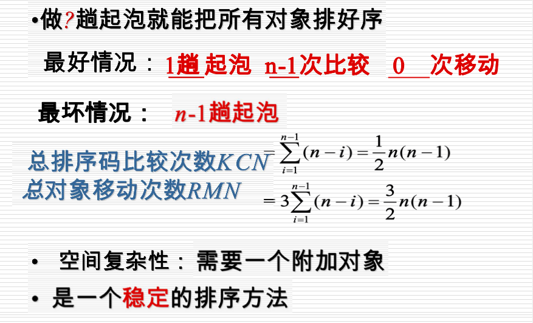

#### 快速排序

##### 交换法

##### 挖空法

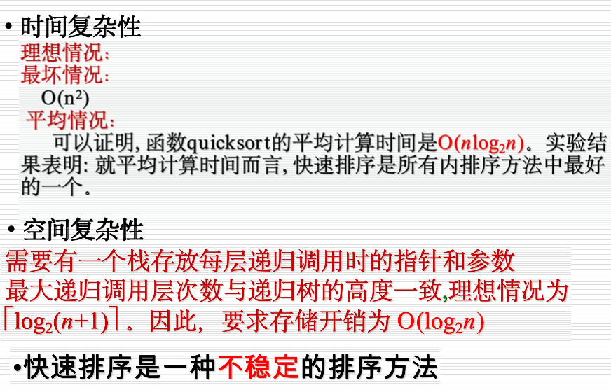

#### 直接选择

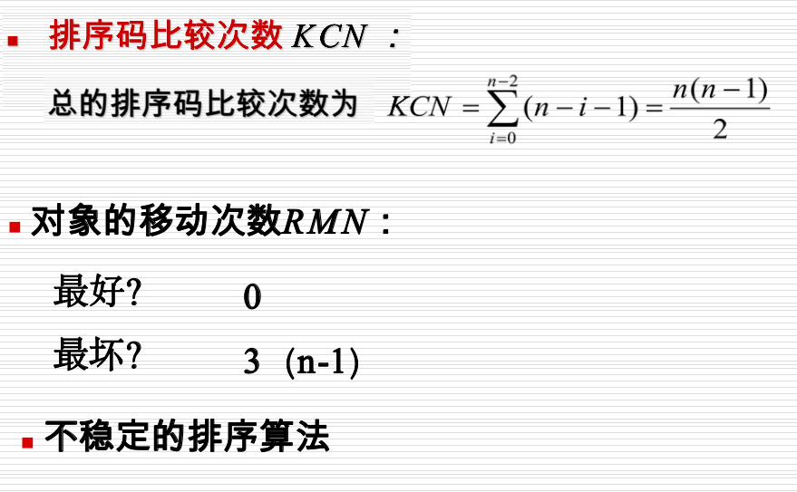

#### 锦标赛（胜者树）

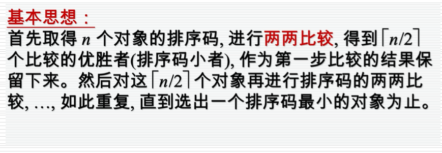

```c++
//胜者树结点类定义
template<class Type>
class DataNode{
    private:
    	Type data;//数据值
    	int index;//结点在🈵️二叉树🀄️的顺序号
    	int avtive;//参选标志：1，参选；0，不参选
}
```

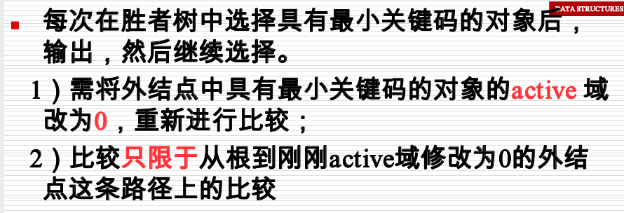


```c++
//锦标赛排序

```


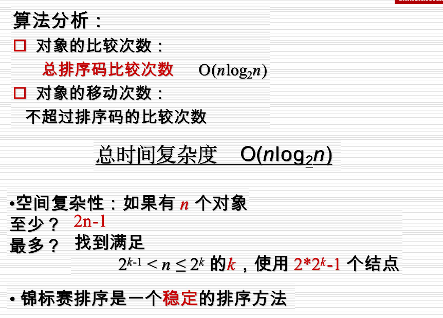


#### 堆排序


#### 归并排序


#### 基数排序

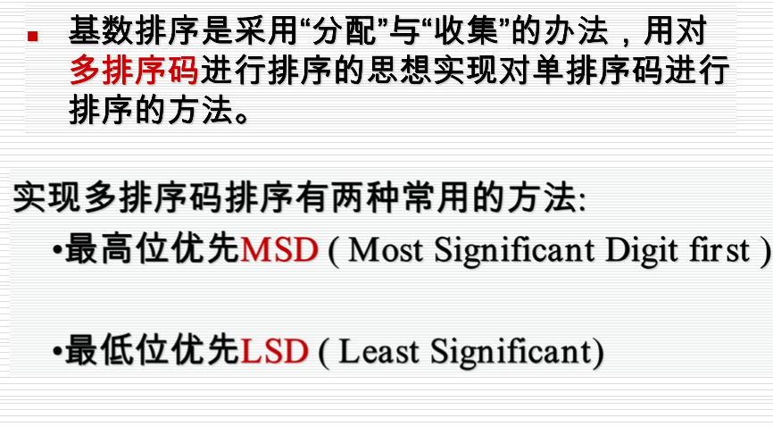

#### 总结


## chap10 文件组织&索引结构


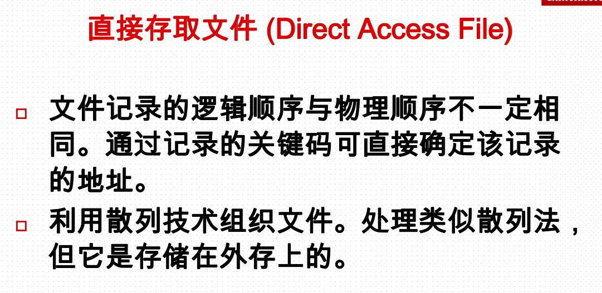

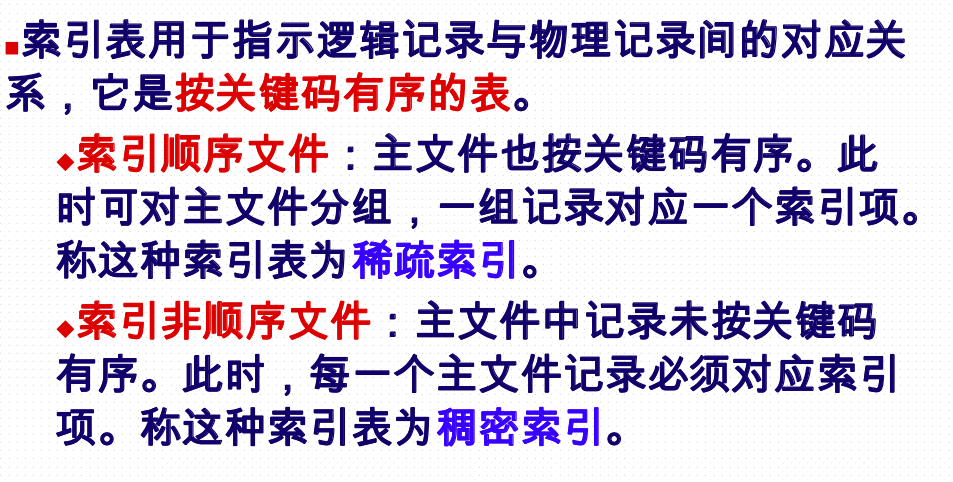


##### 普通m路搜索树

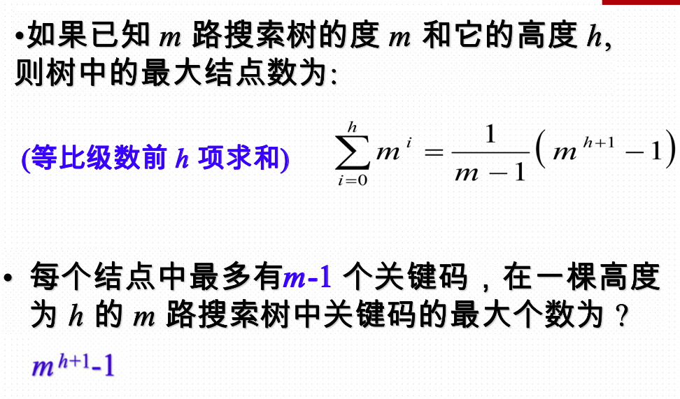

####  B-树


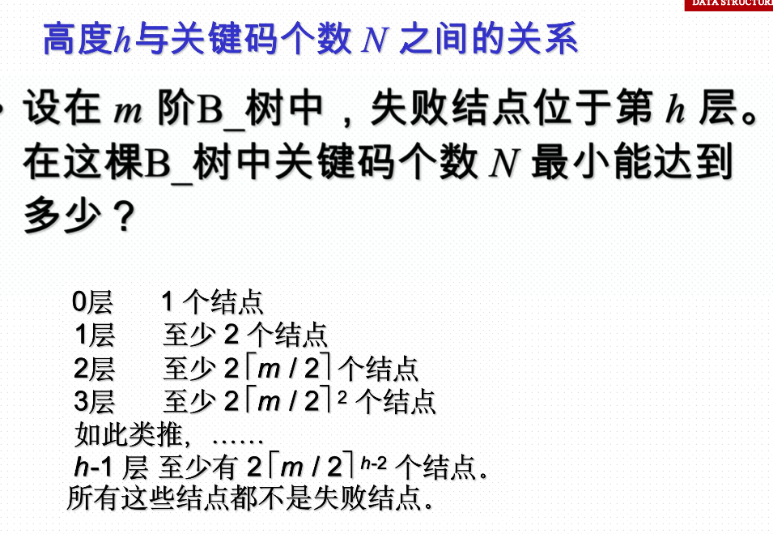

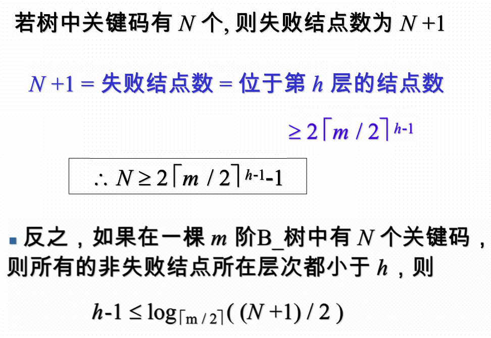


# :x: B -tree 的插入与删除