# 软工冲刺笔记（简答题/书上代码+图）

[TOC]

图例：

⚠️：目前还没掌握

🇨🇳：很重要但没掌握

:white_check_mark: ：重要但目前掌握

:coffee:: 不那么重要，喝杯Java休息一下

注：此笔记不含名词解释

## chap1 软件工程基础

1. :white_check_mark: 软件开发活动：软件开发是软件工程的主要任务，包括需求开发/软件设计/软件构造/软件测试/软件交付与维护

##  chap2软件工程的发展

1. ⚠️软件工程各个年代的发展特征

## chap4 项目管理基础

1. :coffee: 项目的特征：

   * 具有一个明确的目标
   * 有下定的开始和结束日期
   * 有成本限制
   * 消耗人力和非人力资源
   * 多工种合作

2. :coffee: 项目管理的目标：

   * 限定的时间
   * 一定的成本
   * 要求的质量水平
   * 高效的利用资源
   * 获得客户认可

3. 软件项目管理过程组：

   * 项目启动
   * 项目计划
   * 项目执行
   * 项目跟踪与控制
   * 项目收尾

4. 软件项目管理具体活动

   * 计划制定
   * 团队管理
   * 成本控制
   * 质量保障
   * 度量
   * 过程管理
   * 进度跟踪与控制
   * 风险管理
   * 配置管理

5. 团队的特征：

   * 团队成员具有共同的目标
   * 团队成员共担责任
   * 团队成员技能互补
   * 团队是小规模团体
   * 团队内部有明确的结构

6. :white_check_mark: 团队结构：（优缺点）

   * 🐷程序员团队
   * 民主团队
   * 开放团队

7. :coffee: 团队建设：

   * 建立团队章程
   * 持续成功
   * 和谐沟通
   * 避免团队杀手

8. :white_check_mark: 质量保障活动 P56

9. :white_check_mark: 质量保障方法 ：评审，测试，质量度量

10. :warning: 配置管理过程：

    * 标识配置项
    * 版本管理
    * 变更控制
    * 配置审计
    * 状态报告
    * 软件发布管理

11. :cn:变更控制过程

    * 提请者提请变更
    * 接受者接受变更请求
    * 评估者进行评估，并以正式文档的 方式固定下来，并提交给变更控制委员会
    * 变更控制委员会进行变更决策，拒绝或批准变更，并确保已批准变更的实现
    * 修改团队执行变更
    * 验证者验证变更

    

## chap 5 软件需求基础

1. :coffee: 需求工程活动:	

   * 需求开发：需求获取，需求分析，需求规格说明，需求验证
   * 需求管理

2. :coffee: 需求工程的三个主要任务:

   * 需求工程必须说明软件系统将要被应用到环境和目标
   * 需求将目标和功能反应的软件系统当中，映射为可行的软件行为
   * 妥善处理目标和功能随着时间演化的变动情况

3. :coffee: 需求获取的方法：面谈，集体获取方法，头脑风暴，原型

4. :coffee: 需求验证的方法：同级评审，原型，模拟

5. :white_check_mark: 需求的层次性:

6. :coffee: 需求，问题域和规格说明

7. :cn:需求分类：

   * 功能需求： 目标 -- 任务  -- 交互
     * R1用户应该允许顾客退回已经购买的商品
     * R2在使用三个月后，销售额应该提高20%
     * R3系统要帮助收银员完成销售处理
     * R4收银员输入购买商品的标识和数量时，系统要现实该商品的描述，单价， 数量和总价
     * UR1.1系统应该允许客户经理添加/修改或删除会员信息
     * UR1.2 系统应该记录会员的购买信息
     * UR1.3 系统应该允许客户经理查看会员的个人信息和购买信息
     * UR1.4 系统应该原序客户经理查看所有会员的统计信息
     * SR1.1 在接到客户经理的请求后，系统 应该为客户经理通过所有会员信息
     * SR1.2 在客户经理输入会员的客户编号是，系统要提供该会员的个人信息
     * SR1.3 在客户经理选定一个会员并申请查看购买信息时，系统要提供该会员的历史购买记录
     * SR1.4 经理可以通过键盘输入客户编号，也可以通过读卡器输入客户编号
   * 性能需求
     * 速度
     * 容量：
       * 系统应该能存储至少100万个销售数据
     * 吞吐量
     * 负载
     * 实时性
   * 质量属性
     * 可靠性：在规格时间间隔内和规定条件下，系统或部件执行所要求功能更多能力
       * 在客户端与服务器通信时，如果网络故障，系统不能出现故障
     * 可用性：软件系统在投入使用时可操作和可访问的程度或能实现其指定系统功能的概率
       * 系统的可用性要达到98%
     * 安全性：软件阻止对其程序和数据进行未授权访问的能力，未授权访问可能是有意的，也可能是无意的
       * 收银员只能查看，不能修改删除会员信息
     * 可维护性：为排除故障/改进质量或适应环境变化而修改软件系统或部件的容易程度，包括可修改性和可扩展性
       * 如果系统要增加新的特价类型，要能够在2个月内完成
     * 可移植性：
       * 服务器要能在一个月内从window更换到Solaris
     * 易用性
       * 使用系统一个月的收银员进行销售处理的效率达到10件商品/分钟
   * 对外接口：**系统软硬件接口和通信接口**
     * 接口的用途
     * 接口的输入/输出
     * 数据格式
     * 命令格式
     * 异常处理要求
   * 约束
     * 系统开发及运行的环境
       * 用Java开发
     * 问题域内的相关标准
     * 商业规则
   * 数据需求：**需要在数据库，文件或其他介质中存储的数据描述**
     * 各个功能使用的数据信息
     * 使用频率
     * 可访问性要求
     * 数据实体及其关系
       * 数据实体存储的实体-关系图
     * 完整性约束
     * 数据保持要求
       * 系统需要存储一年内的销售记录和退货记录

8. :cn:判断需求类型

   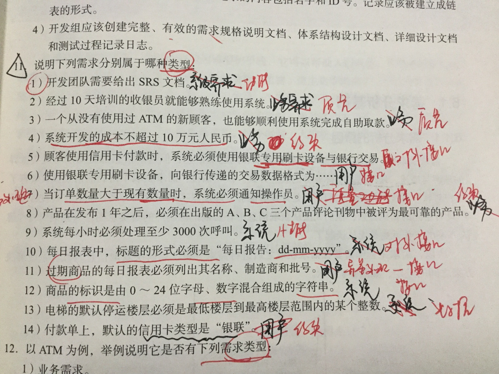

   1. 功能
   2. 质量属性
   3. 质量属性
   4. 约束
   5. 约束「约束的硬件设备」
   6. 对外接口 「传入数据格式」
   7. 功能需求
   8. 质量属性 「可靠性」
   9. 性能 ， 吞吐量
   10. 对外接口 「对报表标题做出限制」
   11. 数据需求 「包含数据属性」
   12. 约束 「商品标识的约定」
   13. 约束
   14. 约束 「银行统一标准」

9. 以ATM为例，举例下列需求类型

   * 业务需求：提供在线转账服务
   * 用户需求：允许用户查询余额
   * 系统需求：在用户点击退卡时，系统应将银行卡从卡槽中推出
   * 功能：系统应提供存款服务
   * 性能：所用用户操作在3秒内得到响应
   * 质量属性：在发生网络故障时，系统不能故障
   * 对外接口：系统与数据库系统的接口
     * 异常处理要求：如果方法抛出异常，数据回滚为未操作前的状态
   * 约束：用java开发
   * 数据：系统要存储一年的操作记录

## chap6 需求分析方法

1. :coffee: 需求分析的任务
   * 建立分析模型，达成开发者和用户对需求信息的共同理解
   * 依据共同的理解，发挥创造性，创造软件系统解决方案
2. :coffee:常见的需求分析模型；
   1. 结构方法：数据流图 实体关系图
   2. 面向对象方法：用例图 类图 交互图 顺序图
3. :coffee:过程分解平衡原则： DFD子图中的输入流/输出流必须和父过程的输入流/输出流保持一致
4. 用例图：
   1. 基本元素：用例 参与者 关系 系统边界
   2. 建立过程：
      * 进行目标分析与确定解决方向
      * 寻找参与者
      * 寻找用例
      * 细化用例：用例合适的判断标准：用例描述了为应对一个业务时间，由一个用户发起，并在一个连续的时间段完成，可以增加业务价值的任务
5. 用例描述
   * ID（目标）
   * 参与者
   * 触发条件
   * 前置条件
   * 后置条件
   * 正常流程
   * 扩展流程
   * 特殊需求
6. 概念类图   P100
   * 识别候选类：名词分析法
   * 筛选候选类，确定概念类：依据系统的需求，该类的对象实例的状态与行为是否全部必要
   * 识别关联
   * 确定重要属性

## chap8 软件设计基础

1. :white_check_mark: 软件设计的核心思想：
   * 分解：在横向上将系统分割为几个相对简单的子系统以及各子系统之间的关系，分解之后只需关注经过抽象的相对简单的字心痛及其之间的关系，从而降低了复杂度
   * 抽象：纵向上聚焦各子系统之间的接口，抽象可以分离接口与实现，让人更好地关注系统本质，从而降低复杂度
2. :cn: 软件设计的分层：
   * 高层设计：基于反应软件高层抽象的构件层次，描述系统的高层接口，关注点和设计决策
   * 中层设计：更加关注组成构件的模块划分，导入导出，过程之间的调用关系或者类之间的协作
   * 底层设计：深入模块和类的内部，关注具体的数据结构，算法，类型，语句和控制结构等
3. :white_check_mark: 软件设计过程等主要活动
   1. 分析设计出发点
   2. 建立候选方案
   3. 确定最终方案
   4. 评价
4. :cn: 软件设计的方法：
   * 结构化设计
   * 面向对象设计
   * 数据结构为中心设计
   * 基于构件的设计
   * 形式化方法设计
5. :coffee:结构化分析方法和面向对象方法的常见模型：
   * 结构化：静态：实体关系图  结构图 动态 ： 数据流图
   * 面向对象：静态： 类图 对象图 构件图 部署图 动态模型：交互图 状态图 活动图
6. :coffee:常见设计视角及其关注点：
   * 逻辑：静态结构（类 接口 及其之间的关系）类型的实现和复用
   * 组合：功能分解和运行时分解/子系统的构造/购买与建造/构件的复用
   * 信息：持久化信息
   * 接口：服务的定义 服务的访问
   * 结构：设计主体的内部构造和组织
   * 依赖：互联 分享 参数化

## chap9 软件体系结构基础

1. :coffee:区分软件体系结构的抽象与实现

   * 以部件 连接见 和配置为基本单位组织的模型就是软件体系结构的抽象，基本目的是描述软件系统的整体功能组织，不涉及程序设计语言提供的各种编程机制
   * 模块 构件 进程等传统单位是依赖于编程机制等，他们组成的模型就被称为软件体系结构的实现

2. :cn: 字符大小写转换系统Capitalize的体系结构实例（主程序/子程序）：

   

3. :white_check_mark: 四种体系结构风格

   |            | 主程序/子程序                                                | 面向对象                                                     | 分层                                                         | MVC                                                          |
   | ---------- | ------------------------------------------------------------ | ------------------------------------------------------------ | ------------------------------------------------------------ | ------------------------------------------------------------ |
   | 定义       | 将系统组织为层次结构，包括一个主程序和一系列子程序，主程序是系统的控制器，负责调度个子程序的执行，各子程序又是局部的控制器，负责调度其子子程序的执行 | 将系统组织为多个独立的对象，每个对象封装其内部的数据，并基于数据对外提供服务 | 根据不同的抽象层次，将系统组织为层次式结构，每个层次被建立为一个部件，部件之间通过程序调用方式进行连接 | 以程序调用为连接件，将系统功能组织为模型，试图，控制器三个部件。模型封装了数据和状态信息，实现业务逻辑；视图封装了用户交互，提供业务展现，接收用户行为；控制器封装系统的控制逻辑； |
   | 建立连接件 | 声明-使用（程序调用）关系                                    | 方法调用                                                     | 程序调用                                                     | 程序调用                                                     |
   | 实现机制   | 模块实现                                                     | 模块实现                                                     |                                                              |                                                              |
   | 优点       | 结构清晰，易于理解；强控制性                                 | 内部实现的可修改性；易开发/易理解/易复用；                   | 设计清晰 易于理解；支持并行开发；更好的可复用性和内部可修改性 | 易开发性；视图和控制的可修改性；适宜于网络系统开发的特征     |
   | 缺点       | 程序调用时一种强耦合方式，系统难以修改和复用；可能会有隐含的数据交流，产生不必要的公共耦合 | 接口的耦合性；标示耦合；副作用                               | 交互协议难以修改；性能损失；难以确定层次的数量和粒度         | 复杂性；模型修改困难                                         |

   

4. :cn: 连锁超市系统的分层结构

   

5. :cn:连锁超市系统的MVC结构

   

6. :cn: KWIC系统（循环位移）的主程序/子程序风格结构 P159

   

7. :cn: KWIC系统（循环位移）的面向对象风格结构 P159

   答案来自[百度文库](https://wenku.baidu.com/view/9fbb78cf5fbfc77da269b15b.html)

   

8. :cn: KWIC系统（循环位移）按算法分解 P218

9. :cn: KWIC系统（循环位移）按决策抽象 P223

## chap10 软件体系结构设计与构建

1. 体系结构设计过程

   1. 分析关键需求和项目约束
   2. 选择体系结构风格
   3. 进行软件体系结构的逻辑（抽象）设计
   4. 依赖逻辑设计进行物理设计
   5. 完善软件体系结构设计
   6. 定义构件接口
   7. 迭代过程 3-6

2. 软件体系结构的实现角度：开发（开发包，物理模块） 发布（进程） 部署（网络额部署）

3. :cn:构件接口规范

   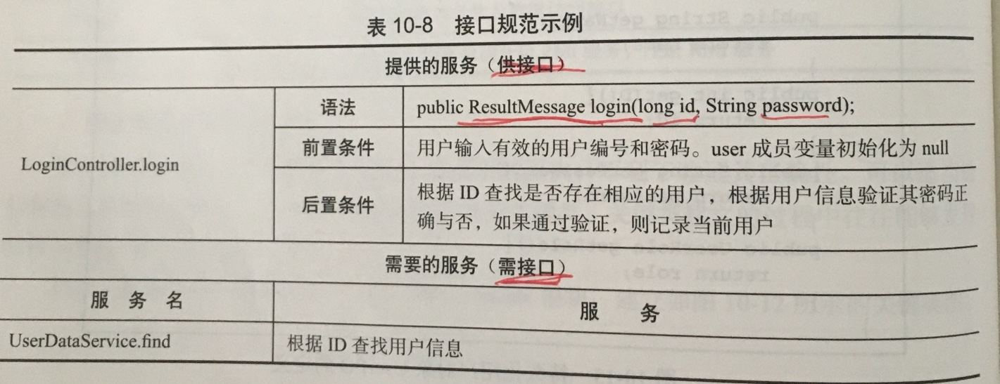

4. :cn: 体系结构集成策略及其优缺点：P177

   * 大爆炸式
   * 增量式
     * 自顶向下
     * 自底向上
     * 三明治式
     * 持续集成：尽早集成&持续集成

5. 桩/驱动/集成测试用例

6. 体系结构评审方法：

   1. 对结果的评审
   2. 对设计决策的评审


## chap11 人机交互设计

1. 易用性：易学性/效率/易记行/出错率/主观满意度
2. 人机交互设计的人类因素：
   * 精神模型 ：用户进行人机交互时头脑中的任务模型
   * 差异性：按照用户群体自身的特点，将其划分为新手用户/专家用户/熟练用户
3. 可视化设计的要点：按照任务模型设计界面隐喻，同时不要把软件系统的内部构造机制暴露给用户
4. 常见的界面类型：批处理/命令行/全屏/图形化/多维交互
5. 人机交互设计的交互行：导航/反馈
6. 人机交互设计的原则：简洁设计/一致性设计/低出错率设计/易记性设计：减少短期记忆负担（自动补全）&使用逐层递进方式展示信息（分层目录）&使用直观的快捷方式/设置有意义的默认值
7. :cn: 人机交互设计的基本过程：导航设计/界面设计/界面原型化/界面评估与修正

## chap12 详细设计基础

1. 按照算法分解：收银员帮助顾客完成购买

   
  
2. 根据数据流图画结构图

   

   

3. 面向对象设计的过程：

   1. 设计模型的建立：
      * 通过职责建立静态设计模型：
        * 抽象类的职责：属性职责&方法职责
        * 抽象类之间的关系
        * 添加辅助类
      * 通过协作建立动态设计模型
        * 抽象对象之间的协作
        * 明确对象的创建
        * 选择合适的控制风格
   2. 设计模型重构：
      * 根据模块化思想进行重构，目标为高内聚/低耦合
      * 根据信息隐藏的思想进行重构，目标为隐藏职责与变更
      * 利用设计模式进行重构

4. 类之间的关系：

   * 依赖  A use a B ：只使用，不持有     - - - - - - >
   * 关联  A has a B : 长期持有     ------->
   * 聚合 A owns B : 所属关系    ------<>
   * 组合 B is a Part of A : 包含关系  -----<*>
   * 继承  B is A :             -------|>
   * 实现 B implements A   - - - - - |>

5. 消息类型

   

6. 顺序图(销售系统)

   

   

7. 合适的控制风格

   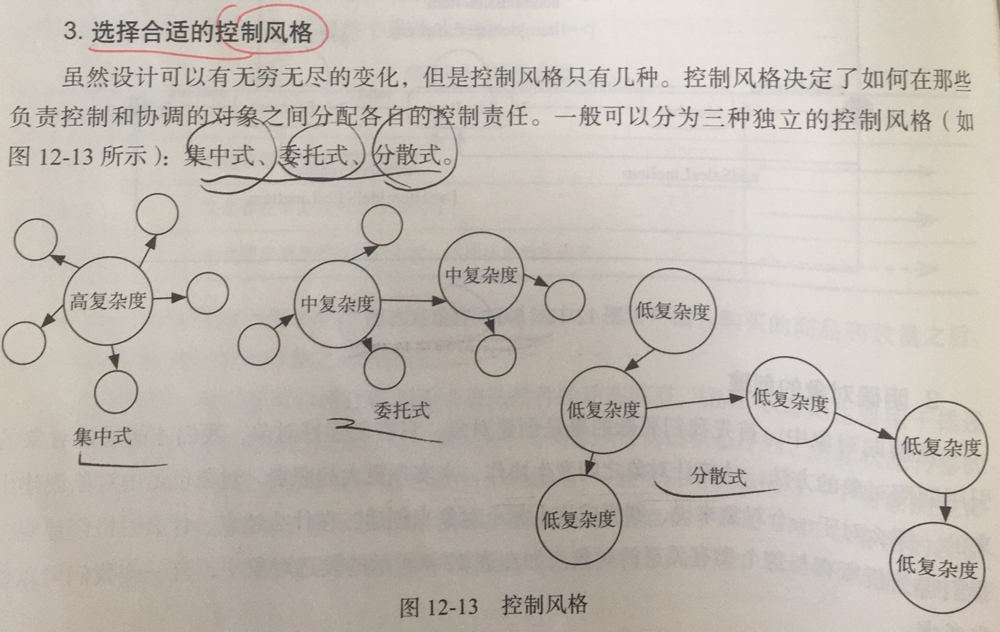

   * 集中式：做决策的往往只有一个对象，由这个对象类决定怎么来分配职责，怎么来实现大的规则
   * 委托式：做决策的对象不止一个，这些对象分别承担一定的职责，作出一定的决策，从而共同实现大的决策
   * 分散式：无法找到明确的控制对象，每个对象都只承担一个相对较小的职责，完全靠各个对象自治的方式来实现大的决策

   8. Mock Object：类间协作的桩程序，它要求自身的测试代码更简单，可以不用测试就能保证正确性

   

   #### 计算总额：代码+顺序图+ :cn: 测试

   根据代码画顺序图/根据顺序图写代码

   1. 顺序图 P211

      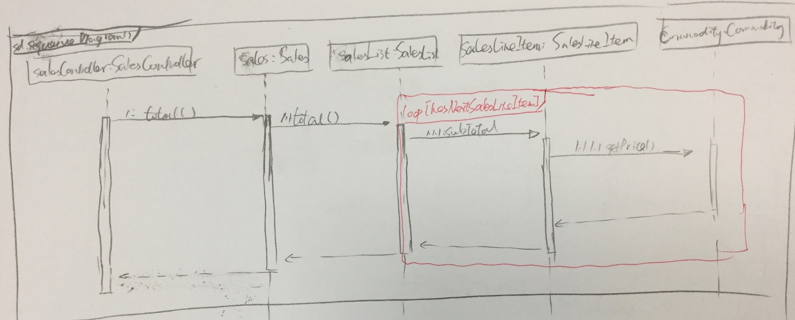

   2. 代码

      ```java 
      public class SalesController{
          private Sales sales;
          public double total(){
              sales.total();
          }
      }
      public class Sales{
          private SalesList salesList;
          public double total(){
              salesList.total();
          }
      }
      public class SalesList{
          private LinkedList<SalesLineItem> salesLineItems = new LinkedList<>();
          public addSalesLineItem(SalesLineItem s){
              salesLineItem.add(s);
          }
          public double total(){
              double total = 0.00;
              Iterator iterator = salesLineItems.iterator();
              while(iterator.hasNext()){
                  SalsesLineItem item = iterator.next();
                  total += item.subTotal();
              }
              return total;
          }
      }
      public class SalesLineItem{
          private int quantity;
          private Commodity commodity;
          public SalesLineItem(Commodity c, int q){
              commodity = c;
              quantity = q;
          }
          public subTotal(){
              return quantity * commodity.getPrice();
          }
      }
      public class Commodity{
          private double price;
          public Commodity(double p){
              price = p;
          }
          public double getPrice(){return price;}
      }
      ```

   3. 自顶向下测试（测试SalesList.total()和SalesLintIem.subTotal()）

      ```java
      public class MockCommondity extends Commondity{
          private double price;
          public MockCommodity(double p){
              price = p;
          }
          public getPrice(){
              return price;
          }
      }
      ```

      测试SalesList.total()和SalesLintIem.subTotal()

      ```java
      public class TotalIntegration tester{
          @test
          public void testTotal{
              MockCommondity commodity1 = new MockCommodity(50);
              MockCommondity commodity2 = new MockCommodity(40);
              
              SalesLineItem salesLineItem1 = new SalesLineItem(commodity1,2);
              SalesLineItem salesLineItem2 = new SalesLineItem(commodity2,3);
              
              SalesList salesList = new SalesList();
              salesList.addSalesLineItem(salesLineItem1);
              salesList.addSalesLineItem(salesLineItem2);
              
              assertEquals(220,salesList.total());
          }
      }
      ```

## chap13 详细设计中的模块化与信息隐藏

   1. 比较按算法分解和按决策分解：
* 从**可修改性**上来说，按决策抽象所有决策秘密都只限于一个模块，按算法分解，则可能涉及多个方面
      * 从**独立开发**的角度来说，按算法分解必须先设计好所有的数据结构，建立复杂/准确的描述，才能并行开发；而按决策首相则只需要定义好各个模块的接口，就可以进行独立的开发，描述也相对简单
   * 从**可理解性**上看，按算法分解必须看到整体才能完全理解，按决策分解则不需要
   2. 模块说明的四个主题
      * 主要秘密：描述这个模块所要实现的用户需求
      * 次要秘密：描述在实现职责时所设计的关键实现细节：包括数据结构/算法/硬件平台等信息
      * 角色：描述独立的模块在整个系统中所承担的决策，所起的作用，以及与哪些模块有关系
      * 对外接口：指模块提供的别的模块的接口
   3. 常见的设计质量的考量：
      * 可理解/易维护/易复用
  
   
  
## Chap14 详细设计中面向对象方法下的模块化

   1. 访问耦合：
   
      * 隐式访问
      * 实现中访问
      * 成员变量访问
      * 参数变量访问
      * 无访问
   
   2. 降低访问耦合的方法
   
      * 针对接口编程
      * 接口最小化/接口分离原则
      * 访问耦合的合理范围/迪米特法则
   
   3. 继承耦合：
   
      * 修改：修改规格/修改实现
      * 精化：精化规格/精化实现
      * 扩展
      * 无
   
   4. 降低继承耦合的方法：
   
      * 里氏替换法则
      * 组合替代继承
   
   5. 类的内聚 P239
   
      ```java
      1. 小记每一购物项金额的方法放在Sales类中
      class Sales{
          HashMap<Integer,SalesLineItem> map;
         	public void getSubtotal(int CommodityID){
              int price = map.get(id).getCommodity().getPrice();
              int quantity = map.get(id).getQuantity;
              return price*quantity;
          }
      }
      //问题：方法和属性不一致
      
      //按照信息内聚的要求：类中存的属性是 salesLineItem的Map，类中的方法应该是针对这个map进行的
      //因此，在这个map的基础上进行的操作应该是 计算这个map里面所有SalesLineItem 的总金额
      
      //而计算单个 SaleLineItem 的 getSubtatal() 方法应该放在 SalesLineItem 里面
      
      class Sales{
          HaspMap<Integer,SalesLineItem>map;
          public double getTotla(){
              double total = 0.00;
              Iterator iterator = map.iterator();
              while(iterator.hasNext()){
                  
                  SalesLineItem item = iterator.next();
                  total += item.getSubtotal();
              }
              return total;
          }
      }
      class SalesLineItem{
          Commodity commodity;
          int quantity;
          public double getSubtotal(){
              return commodity.getPrice()*quantity;
          }
      }
      ```
   
      ```java
      2. 学号/姓名/成绩/课程编号/课程在同一个类中
      class Socre{
          int studentID;
          String name;
          int score;
          int courseID;
          string courseName;
      }
      //属性之间没有体现一个职责
      class Student{
          int studentID;
          String name;
      }
      class Course{
          int courseID;
          String courseName;
      }
      class Score{
          Student student;
          Course course;
          int score;
      }
      //类似于ER图的改进
      //使其满足第三范式
      ```
   
      
   
      ```java
      3. 属性之间可否抽象
      //生产年份，生产月份，生产日期，进货年份，进货月份，进货日期在一个类里面
      class Product{
          int yearOfProduction;
          int monthOfProduction;
          int dayOfProduction;
          int yearOfImport;
          int monthOfImport;
          int dayOfImport;
      }
      //属性之间可以进一步抽象
      class Date{
          int year;
          int month;
          int day;
      }
      class Product{
          Date productionDate;
          Data importDate;
      }
      ```
   
   6. 提高内聚的方法
   
      * 集中信息与行为
      * 单一职责原则
   
   7. 位置类
   
      ```java 
      public class Positon{
          public double latitude;
          public double longtitude;
      }
      public class PositonOperation{
          public double calculateDistance(Position one,Position two){
              
          }
          public double calculateDirection(Position one, Position two){
              
          }
      }
      
      //符合职责驱动的位置类
      public class Position{
          public double latitude;
          public double lontitude;
          
          public double calculateDistance(Position pos){
              
          }
          public double calculateDirection(Position pos){
              
          }
      }
      ```
   
   8. 耦合的度量
   
   9. 

## chap15 详细设计中面向对象方法下的信息隐藏

1. 封装的含义

   * 将数据和行为同时包含在类中
   * 分离对外接口与内部实现

2. 封装内部结构

   路径类

   ```java
   public class Route{
       private Position[] positions;
       public Route(int segments){
           positions = new Postion[segments+1];
       }
       public void setPostion(int index, Position position){
           position[index] = position;
       }
       public Position getPosition(int index){
           return positions[index];
       }
       public double distance(int setmentNumber){}
       public double heading(int segmentNumber){}
       
       
       //下面getPositons()暴露了「内部实现是数组」这个设计决策
       public Position[] getPositions(){
           return positions;
       }
   }
   //不应该暴露内部实现决策
   
   //隐藏内部结构
   public class Route{
       private Position[] positions;
       public Route(int segments){
           positions = new Postion[segments+1];
       }
       public void setPostion(int index, Position position){
           position[index] = position;
       }
       public double distance(int setmentNumber){}
       public double heading(int segmentNumber){}
       
        //暴露的接口是抽象的行为
    	public void append(position){
           positions.append(position);
       }
       //隐藏类的内部结构
       public Position getPosition(int index){
           return positions.get(index);
       }
   }
   //对于有些特殊需求，会要求不能暴露对象引用
   //那上面这个代码就不够好了，因为getPosition 直接返回了对象引用
   public class Route{
       ...
       //重新构造一个对象返回，隐藏了实现细节
       public Position getPosition(int index){
           Position position = nwe Postion(positions.get(index));
           return position;
       }
   }
   ```

3. 封装潜在变更

   ```java
   
   ```

4. 开闭原则

5. 多态

   * 多态的分类：一般性多态，参数化多态（模版/泛化），临时性多态（重载/强制转换）

6. 依赖倒置

   * 抽象不应该依赖于细节，细节应该依赖于抽象
   * 高层模块不应该依赖于底层模块，双方都依赖于抽象

   ```java
   public class Client{
       public static void main(String[]args){
           Sales sales = new Sales();
           SalesMapper salesmapper = new SalesMapper();
           //SalesMapper salesmapper = new SalesMapper2();
           sales.setSalesMapper(salesmapper);
           sales.endSales();
       }
   }
   public class Sales{
       private SalesMapper salesmapper;
       public void setSalesMappera(SalersMapper mapper){
           salesmapper = mapper;
       }
       public void endSales();
           salesMapper.insert(salesPO);
           salesMapper.save();
    }
   }
   //不应该依赖于具体的 SalesMapper ,
   //而应该依赖于抽象
   //违反了了 OCP 和DIP
   public class Client{
       public static void main(String [] args){
           Sales sales = new Sales();
           SalesMapperService salesmapper = new SalesMapper();
           //SalesMapperService salersmapper = new SalesMapper2();
           sales.setSalesMapper(salesmapper);
           //...
           sales.endSales();
       }
   }
   public class Sales{
       private SalesMapperSerivce salesmapper;
       public void setSalesMapper(SalseMapperService mapper){
           salesmapper = mapper;
       }
       public void endSales(){
           
       }
   }
   public interface SalesMapperService{
       public void insert();
       public void save();
   }
   public class SalesMapper implements SalesMapperService{
       
   }
   //利用DIP实现了OCP
   //类似的，策略模式也是用DIP实现了OCP
   ```

   

   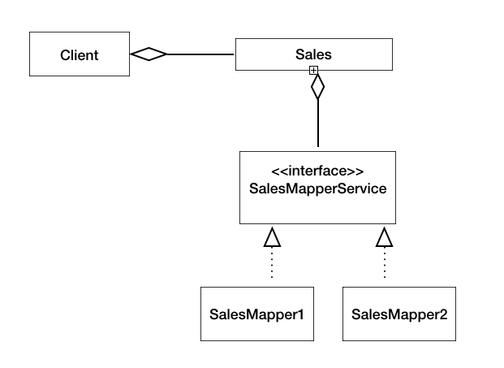

7. 分层结构的DIP

   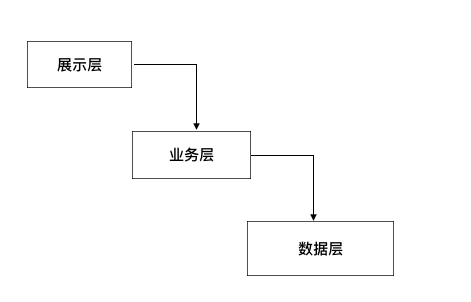

   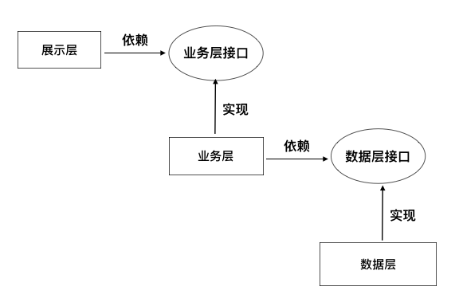


课后习题13&14

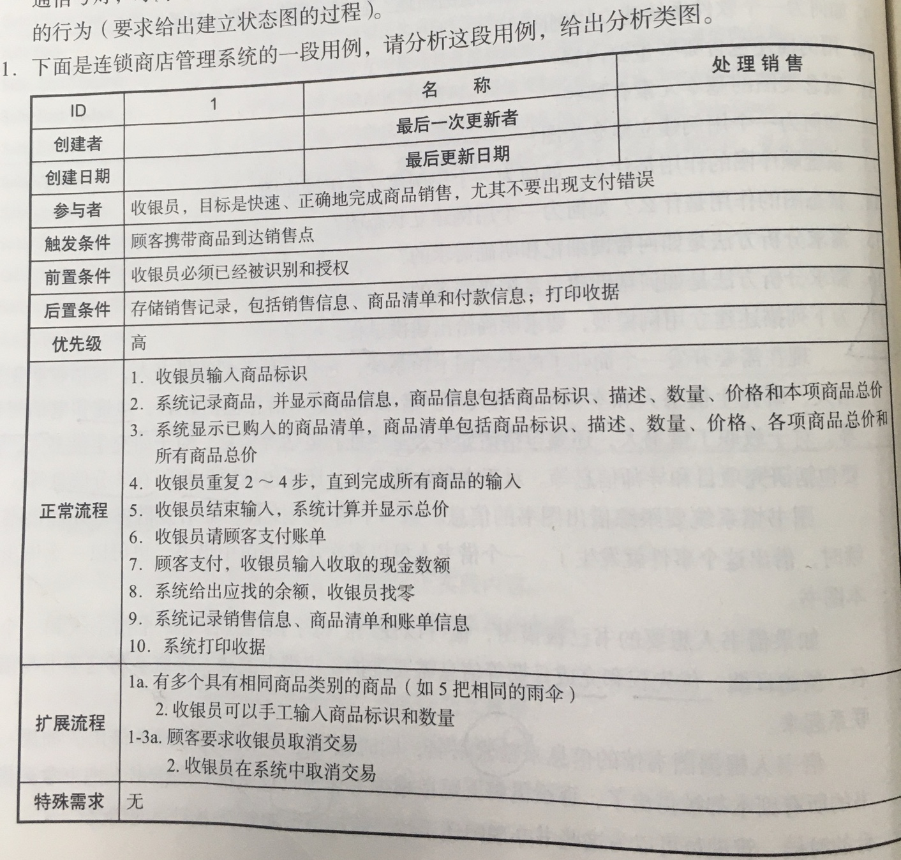


```c++
public class SalesView{
    private SalesLogic salesLogic;
    ...
    public SalesView(){
        salesLogic = new SalesLogic();
    }
    buttonFinishInput.addActionListener(new ActioinListener(){
        public void actionPerformed(ActionEvent e){
            //	按键响应的代码
            int total;
            total = salesLogic.getSalesTotal();
            textAreaTotal.setText("total:"+total);
        }
    })
}
public class SalesLogic{
    private SalesData salesData;
    public SalesLogic(){
        salesData = new SalesData();
    }
    public int getSalesTotal(){
        int total = 0;
        for(int id = 1;id<=10000;id++){
            total += salesData.getTotalBySalesID(id);
        }
        return total;
    }
}
public class SalesData{
    String filename = "sales.txt";
    public SalesData(){}
    public int getTotalBySalesID(id){
        DataRecord r = readRecordFromFile(id);
        int total = totalTotalFromFile(r);
        return total;
    }
    private DataRecord readRecordFromFile(int id){
        //从销售数据文件中读取对应id 的文件记录
        //并把文件记录封装成DataRecord格式返回
        return 文件记录
    }
    private int getTotalFromRecord(DataRecord r){
        //根据读取出的文件记录 r， 提取出销售额
        return 销售额;
    }
}
public class DataRecord{
   	//应该是自定义的一种存储格式
}

```

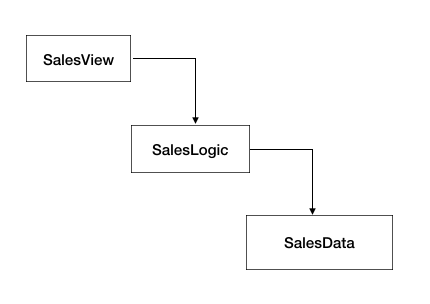

* 从信息隐藏角度看，对象SalesView,SalesLogic,SalesData 各自隐藏的Secret有哪些?

  * P225主要秘密（实现的用户需求），次要秘密（关键实现细节）

    

    |            | 主要秘密     | 次要秘密                                             |
    | ---------- | ------------ | ---------------------------------------------------- |
    | SalesView  | 显示销售总价 | 监听用户结束输入的行为；按键响应算法；               |
    | SalesLogic | 计算销售总价 | 遍历用户所购商品的ID，并累加每件商品的总价格         |
    | SalesData  | 存储销售记录 | 从文件中读取指定ID的记录，并把记录中的销售总额返回； |

* 有没有对象违反信息隐藏的原则，为什么，如果有，给出修正

  SalesData类违反了单一职责原则和信息隐藏原则

  *  单一职责：
    * SalesData 负责数据层的服务，但是实现了计算商品销售总额的逻辑，违反单一职责原则，使分层之间界限不够明确。
    * 应该把计算销售总额的代码放到逻辑层，数据层将DataRecord 传入逻辑层
  * 信息隐藏：
    * 去除方法名中的 __FromFile ，不对外公布从文件中查找的细节

  ```java
  public class SalesData{
      String filename = "sales.txt";
      public SalesData(){}
      public record getRecordByID(id){//从文件中找出标识为id的记录
         DataRecord record = null;
         while((text = bufferReader.readLine())!=null){
             xxx
         }
          return record;
      }
  }
  public class SalesLogic{
      private SalesDataService salesData;
      public SalesLogic(){
          salesData = new SalesDataService();
      }
      public int getSalesTotal(){
          int total = 0;
          for(int id = 1;id<=10000;id++){
              total += getTotalBySalesID(int id);
          }
          return total;
      }
      public int getTotalBySalesID(int id){
          int total = 0;
          DataRecord record = salesData.getRecordByID(id);
          total = record.getPrice * record.getQuantity();
      }
  }
  public class DataRecord{
      
  }
  ```

* 数据存在Txt文件上的，以后会存在数据库里，Data层代码改动会使得Logic也会有被影响的风险，改进之

  ```java
  public class SalesView{
      private SalesLogicService salesLogic;
      ...
      public SalesView(){
          salesLogic = new SalesLogicService();
      }
      buttonFinishInput.addActionListener(new ActioinListener(){
          public void actionPerformed(ActionEvent e){
              //	按键响应的代码
              int total;
              total = salesLogic.getSalesTotal();
              textAreaTotal.setText("total:"+total);
          }
      })
  }
  public interface SalesLogicService{
      public int getSalesTotal();
  }
  public class SalesLogic implements SalesLogicService{
      private SalesDataService salesData;
      public SalesLogic(){
          salesData = new SalesDataService();
      }
      public int getSalesTotal(){
          int total = 0;
          for(int id = 1;id<=10000;id++){
              total += getTotalBySalesID(int id);
          }
          return total;
      }
      public int getTotalBySalesID(int id){
          int total = 0;
          DataRecord record = salesData.getRecordByID(id);
          total = record.getPrice * record.getQuantity();
      }
  }
  public interface SalesDataService{
      public int getTotalBySalesID(int id);
  }
  public class SalesData implements SalesDataService{
      String filename = "sales.txt";
      public SalesData(){}
      public record getRecordByID(id){//从文件中找出标识为id的记录
         DataRecord record = null;
         while((text = bufferReader.readLine())!=null){
             xxx
         }
          return record;
    }
  }
  ```
  
  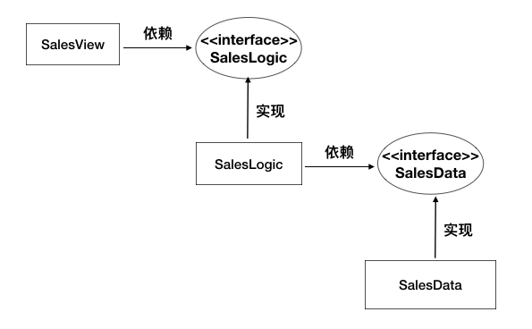

总结：

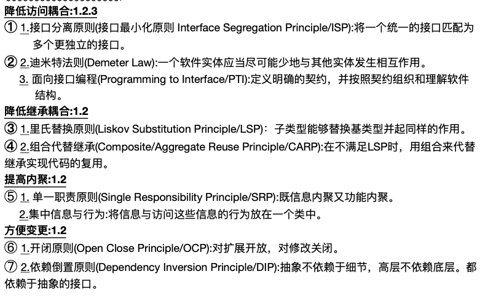

## chap16 设计模式

1. 可修改性

   |          | 接口和实现                                       | 子类继承父类                                 |
   | -------- | ------------------------------------------------ | -------------------------------------------- |
   | 可修改性 | 实现类的改变不影响调用接口                       | 子类的改变不影响调用接口                     |
   | 可扩展性 | 通过增加实现类                                   | 通过增加子类                                 |
   | 灵活性   | 通过多态：灵活选择用哪个实现类，而不影响调用接口 | 通过多态：灵活选择用哪个子类，而不影响调用接 |

2. 接口与实现分离的 方法：

   * 通过接口和实现该接口的类完成
   * 通过子类继承父咧，将父类的接口和子类的实现相分离

3. 前端后端

   ```java
   class Backend{
       public int method2(){
           
       }
   }
   public Frontend{
       public Backend back = new Backend();
       public int method2(){
           back.method2();
       }
   }
   class Client{
       public static void main(String[]args){
           Frontend front = new Frontend();
           int i = front.method2();
       }
   }
   ```

   利用组合关系：既能复用代码有能保持接口的灵活性

4. 策略模式 --- 薪水支付

   ```java
   public class TestDriver{
       public static void main(String []args){
           Employee tom = new Employee("tom",0);
           Employee jack = new Employee('jack',1);
           Employee kevin = new Employee("kevin",2);
           
           //
           HourlyClassification hc = HourlyClassification(10,40);//
           CommissioinedClassification cc = CommissionedClassification(0.01,1000000);
           SalariedClassification sc = SalariedClassification(3000);
           
           //
           WeeklySchedule ws = new WeeklySchedule(2012,Calendar.FEBRUARY,22);
           ...
               
           tom.setPaymentClassification(hc);
           tom.setPaymentSchedule(ws);
           
           jack.setPaymentClassificaiton(cc);
           jack.setPaymentClassificaiton(bs);
           
           kevin.setPaymentClassification(sc);
           kevin.setPaymentSchedule(ms);
           
           //
           
       }
       
   }
   public class Employee{
       private String name;
       private int id;
       private PaymentClassification pc;
       private PaymentSchedule ps;
       public Employee(String n, int i){
           name = n;
           id = i;
       }
       public void setPaymentClassification(PaymentClassification c){
           pc = c;
       }
       public void setPaymentSchedule(PaymentSchedule s){
           ps = s;
       }
       public void getPayment(){
           double payment = 0;
           payment = pc.calculatePayment();
           System.out.print(name + 'Get' + payment+"dollars");
       }
       poublic boolean isPay(){
           boolean isPay = false;
           isPay = ps.isPay();
           if(isPay){
               System.out.print('A payDay for' +name + "!");
           }
           return isPay;
       }
       
   }
   public interface PaymentClassification{
       public double calculatePayment();
   }
   public class HourlyClassification implements PaymentClassification{
       public double calculatePayment(){
           
       }
   }
   public class CommissionedClassification implements PaymentClassification{
       public double calculatePayment(){
           
       }
   }
   public class SalariedClassification implements PaymentClassification{
       public double calculatePayment(){
           
       }
   }
   public interface PaymentSchedule{
       public boolean isPay();
   }
   public class WeeklySchedule implements PaymentSchedule{
       public boolean isPay(){
           
       }
   }
   public class MonthlySchedule implements PaymentSchedule{
       public boolean isPay(){
           
       }
   }
   public class BiweeklySchedule implements PaymentSchedule{
   	public boolean isPay(){
           
       }    
   }
   ```

   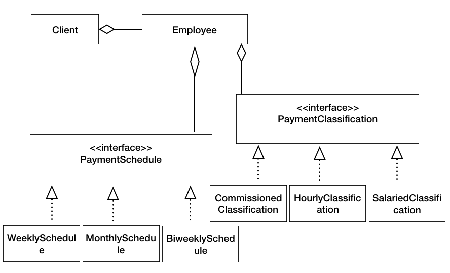

5. 抽象工厂模式

   构造方法无法实现多态

   * 简单工厂

     ```java
     class Client1 extends Client{
         public ClassA createClassA(){
             if(type == 1){
                 Class a = new ClassA1();
             }else{
                 Class a = new ClassA2();
             }
             return a;
         }
     }
     ```

   * 抽象工厂

     ```java
     public interface DatabaseFactory{
         public CommodityDataBaseService getCommodityDatabase();
         public UserDatabaseService getUserDatabase();
         public MemberDatabaseService getMemberDatabase();
         public SalesDatabaseService getSalesDatabase();
     }
     public class DatabaseFactoryMySqlImpl implements DatabaseFactory{
         CommodityDatabaseService commodityDatabase = new CommodtiyDatabaseServiceMySqlImp();
         UserDatabaseSerice userDatabase = new UserDatabaseServiceMySqlImp();
         MemberDatabaseService memberDatabase = new MemberDatabaseServiceMySqlImp();
         SalesDatabaseService saleDatabase = new SalesDatabaseServiceMySqlImp();
         
         public getCommodityDatabase(){
             return commodityDatabase;
         }
         public getUserDatabase(){
             return userDatabase;
         }
         public getMemberDatabase(){
             return memberDatabase;
         }
         public getSalesDatabase(){
             return salesDatabase;
         }
     }
     public interface UserDataService{
         
     }
     public class UserDataServiceMySqlImp implements UserDataService{
         //用组合代替继承
         private DatabaseMySqlImpl mysql = new DatabaseMySqlImpl(d);
         private final String tableName = "user";
         private Connection conn = nul;
         ...
     }
     ```

     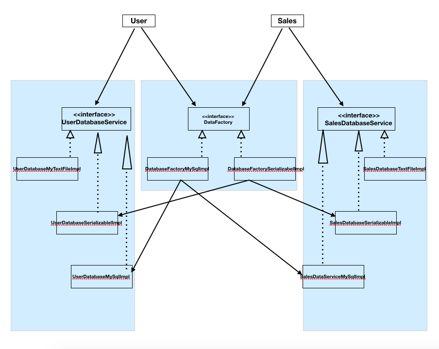

     * 抽象工厂是所有工厂的接口
     * 使用抽象工厂的客户类 User/Sales 依赖抽象工厂，以提高可修改性/可扩展性/灵活性
     * 具体工厂是，按某种方式生产各种产品的方法封装在一起
     * 比如：MySql实现的数据库工厂/TextFile实现的数据库工厂
     * 客户类（User/Sales）依赖抽象产品和抽象工厂
     * 具体工厂依赖具体产品

6. 单例模式

   ```java
   //书上的
   public class DatabaseFactoryTxtFileImpl implements DatabaseFactory{
       private static DatabaseFactoryTxtFileImpl databaseFactoryTxtFile;
       private DatabaseFactoryTxtFileImpl(){
           //construction function
       }
       public static DatabaseFactory getInstance(){
           if(databaseFactoryTxtFile = null){
               databaseFactoryTxtFile = new DatabaseFactoryTxtFileImpl();
               return databaseFactoryTxtFile;
           }
       }
   }
   
   //饿汉式
   //线程安全
   //没有懒加载
   //类一旦加载，单例就初始化完成
   public class Singleton{
       private Singleton(){};//私有化构造器
       private static final Singleton instance = new Singleton();
       public static Singleton getInstance(){
           return instance;
       }
   }
   //懒汉式
   //线程不安全
   //懒加载
   //只有调用 getInstace() 的时候，单例才被初始化
   
   public class Singleton{
       private Singleton(){};
       private static Singleton instance;
       public static Singleton getInstance(){
           if(instance==null){
               instance = new Singleton();
           }
           return instance;
       }
   }
   
   //解决线程安全问题
   //同步方法
   public class Singleton{
       private Singleton(){};
       private static Singleton instance;
       public static synchronized Singleton getInstance(){
           if(instance==null){
               instance = new Singleton();
           }
           return instance;
       }
   }
   ```

   

7. 迭代器模式

   ```java
   Iterator i = xxx.iterator();
   i.hasNext();
   next();
   ```

   

8. 总结

   1. | 设计模式     | 参与者                                         | 使用的设计原则       | 优点                                                         | 缺点                                                         |
      | ------------ | ---------------------------------------------- | -------------------- | ------------------------------------------------------------ | ------------------------------------------------------------ |
      | 策略模式     | 上下文；策略；具体策略                         | 减少耦合；依赖倒置   | 消除Switch语句；可以动态选择不同的策略；                     | 客户必须提前知晓不同的的策略；会创建出较多的对象             |
      | 抽象工厂模式 | 抽象工厂；具体工厂；抽象产品；具体产品；客户； | 职责抽象；接口的重用 | 对产品对配置更加灵活；使得产品之间有一定对一致性，同类产品容易一起使用； | 对新产品类型的支持比较苦难；抽象工厂的接口一旦定义好，就不容易变更了 |
      | 单例模式     | 单件；客户                                     | 职责抽象             | 可以避免使用全局变量                                         |                                                              |
      | 迭代器模式   | 迭代器；具体迭代器；聚合；具体聚合             | 减少耦合；依赖倒置   | 访问一个聚合对象的内容而无需暴露它的内部实现；支持对聚合对象的多种遍历；为遍历不同的聚合结构提供统一接口 |                                                              |

## chap17 软件构造

1. 重构 -

   ```java
   public class Member{
       private long id;
       private String name;
       private long point ;
       
       public void updata(){
           MapperService memberMapper = MemberMapper.getInstance();
           memberMapper.update(id,name,point);
       }
   }
   //上述代码有效使用了
   //单例模式
   //满足了依赖倒置原则
   //但传递参数时数据封装不够，不应直接传基本数据类型
   
   public class Member{
       private long id;
       private String name;
       private long point ;
       
       public void updata(){
           MapperService memberMapper = MemberMapper.getInstance();
           MemberPo po = new MemberPo(id,name,point);
           memberMapper.update(po);
       }
   }
   public class MemberPo implements Serializable{
       private long id;
       private String name;
       private long point;
       public MemberPo(long i,String n, long p){
           id = i;
           name = n;
           point = p;
       }
   }
   ```

2. 测试驱动开发

   ```java
   public class GetChapgeofSalesTester{
       public static void main(Strin []args){
           Sales sale = new Sales();
           //购买两个ID=1的商品，该商品的price为45
           sale.addSalesLineItem(1,2);
           sale.total();
           
           double change ;
           boolean passed = true;
           //1.
           change = sale.getChange(-100);
           if(change!=-1){//如果getChange方法的结果不对，就报错
               passed = false;
               System.out.println("parameter exceptin not handled");//输出的语句应该根据错误类型而不同
           }
           
       }
   }
   ```

   使用JUnit

   ```java
   @RunWith (value = Parameterized.Class)
   public class SalesTester{
       private double payment;
       private double change;
       
       @parameters
       public static Collection<Double[]> getTestParameters(){
           return Array.asList(new Double [][]{
               //payment ,change
               {-100,-1},
               {0,-1},
               {50,-2}
           });
       }
       public ParameterizedTest(double payment ,double change){
           this.payment = payment;
           this.change = change;
       }
       @Test
       public void testChange(){
           Sales sale = new Sales();
           sales.addSalesLineItem(1,2);
           sale.total();
           
           assertEquals(change,sale.getChange(payment));
       }
   }
   ```

   

   * addSalesLineItem 方法的TDD 代码 :x:

   ```java
   
   ```

   

   * total 方法的TDD 代码

   ```java
   public class totalTester{
       public static void main(String[]args){
           Sales sale = new Sales();
           
           double total = 0;
           boolean passed = true;
           //1 
           sale.addSalesLineItem(1,2);
           total = sale.total();
           if(total!=90){
               passed = false;
               System.out.println("error");  //具体输出的内容，取决于错误类型
           }
           
           sale.addSalesLineItem(1,0);
           total = sale.total();
           if(total!=90){
               passed = false;
               System.out.println("error"); //具体输出的内容，取决于错误类型
           }
           
       }
   }
   ```

   注意⚠️：应先测试驱动开发 addSalesLineItem,然后total方法，最后才能测试驱动开发 getChange()方法

3. 结对编程

## chap18 代码设计

1. 修改过程内聚

```java
public class Sales extends DomainObject{
    public void endSales(){
        MapperManager mapperManager = MapperManager.getInstance();
        
        //upate member
        MapperService memberMapper = mapperManager.getMemberMapper();
        MemberPO menberPO = menber.getPO();
        menberMapper.updata(memberPo);//此处使用了chap17所讲到的：传递参数时应将数据封装，而不直接传递基本数据类型 
        memberMapper.save();
        
        //update 库存
        ...
            
        //update payment
        MapperService paymentMapper = mapperManager.getPaymentMapper();
        PaymentPO paymentPO = payment.getPO();
        ...
        
            
        //update sales
        MapperSErvice salesMapper = mapper.Manager.getSalesMapper();
    }
}

//mapperManager 是一个工厂
//用来生产各种Mapper
//mapperManager工厂只有一个，大家公用
//因此使用单例模式

//但是过程内聚：一个部分的修改可能对其他部分带来风险

//改进
public class Sales extends DomainObject{
    public void endSales(){
        member.update();
        payment.update();
        this.update();
    }
}
```


2. 复杂决策：

   * 使用新的布尔变量来简化复杂决策

   ```java
   if((atEndofStream)&&(error!=imputError)&&
     ((MIN_LINES <= lineCount)&&lineCount <= MAX_LINES))&&
     (!errorProcessing(errror)){
       
   }
   //改进
   boolean allDataReaded = ((atEndofStream)&&(error!=inputError));
   boolean validLineCount = (MIN_LINES <= lineCount)&&lineCount <= MAX_LINES);
   
   if(allDataReaded && validLineCount && !errorProcessing(error)){
       
   }
   ```

   * 使用有意义的名称封装复杂决策

   ```java
   if(id>0&&id<MAX_ID)
   ---> 
   boolean isIDValid(id){
       return id>0 && id<MAX_ID;
   }
   if(isIDValid(id))
   ```

   

   * 表驱动编程

   ```java
   prePointArray = {1000,2000,5000};
   postPointArray = {1000,2000,5000};
   levelArray = {1,2,3};
   for(int i = 0;i<=2;i++){
       if(prePoint < prePointArray[i] && postPoint >= postPointArray[i]){
           triggerGiftEvent(levelArray[i]);
       }
   }
   ```

3. 契约式设计

   ```java
   // 异常方式
   public class Sales extends DomainObject{
       ...
       public double getChange(double payment)throws PreException,PostException{
           //检查前置条件
           if(pay <=0 || (payment < total)){
               throw new PreException("Sales.getChange:payment"+String.valueOf(payment)+";total"+String.valueOf(total));
               
               }
           ...
           //检查后置条件
           if(result != (payment-total)){
               throw new PostException("Sales.getChange:payment"+String.valueOf(payment)+";total"+String.valueOf(total));
           }
           return result;
       }
   }
   //断言方式
   
   public class Sales extends DomainObject{
       ...
       public double getChange(double payment)throws PreException,PostException{
           //检查前置条件
           assert(payment > 0&& (payment >= total ))::("Sales.getChange:payment"+String.valueOf(payment)+";total"+String.valueOf(total));
           ...
           //检查后置条件
           assert(result != (payment-total)):("Sales.getChange:payment"+String.valueOf(payment)+";total"+String.valueOf(total));
           
           return result;
       }
   }
   ```

4. 使用Mock Object 测试类

   ```java
   同P211
   ```


# 附录

## 用例图的画法


## 概念类图的画法

### 书上的例子

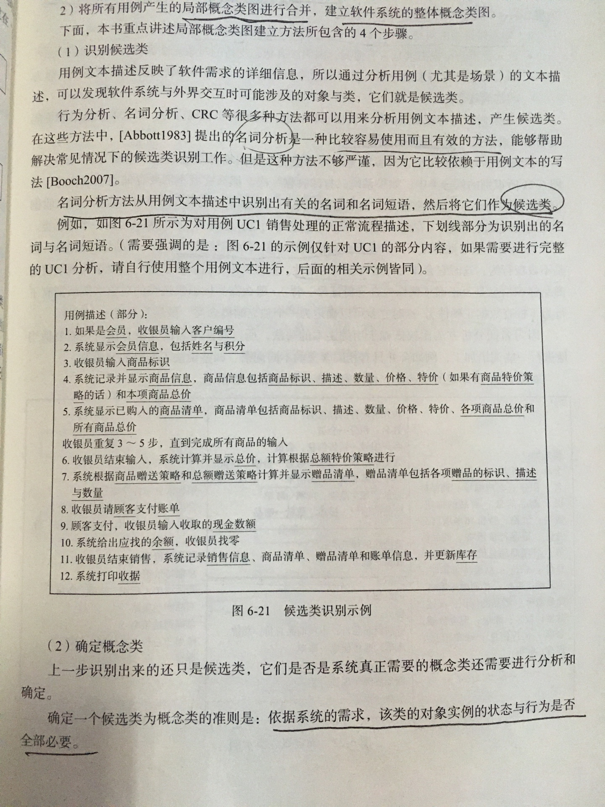

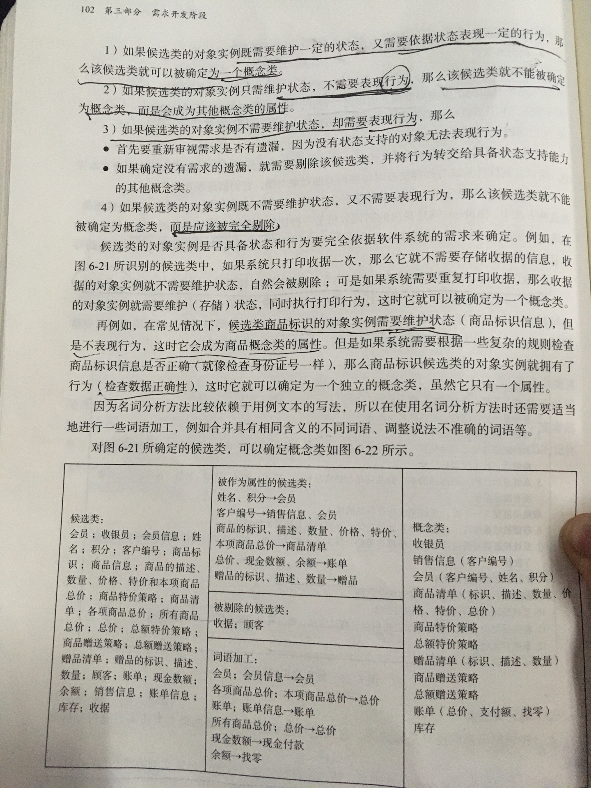

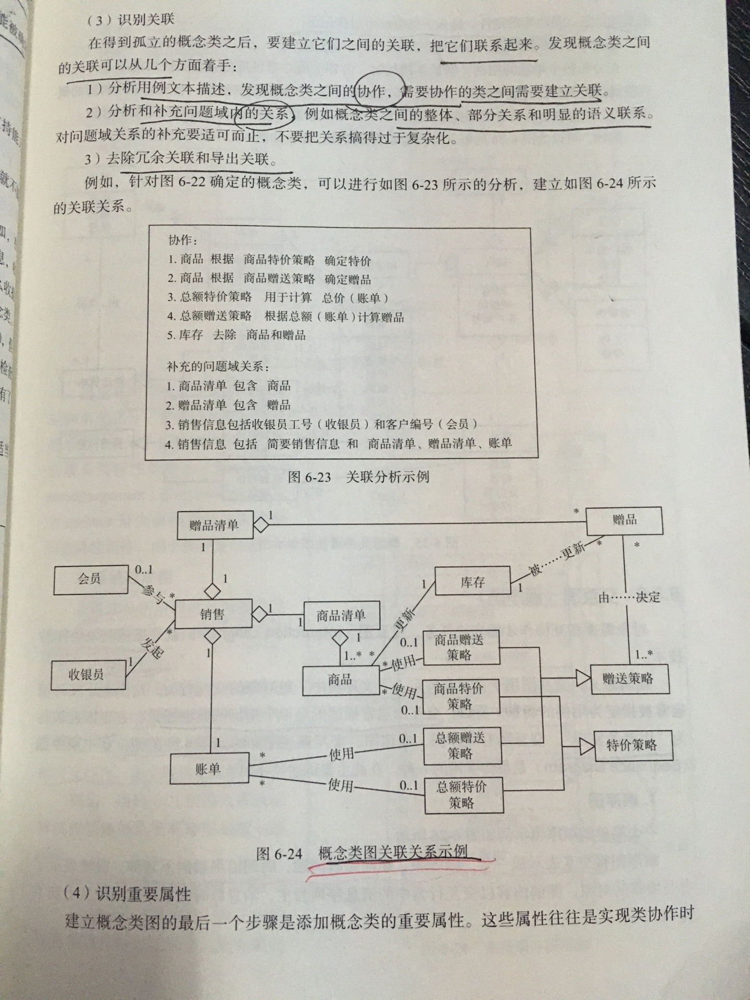

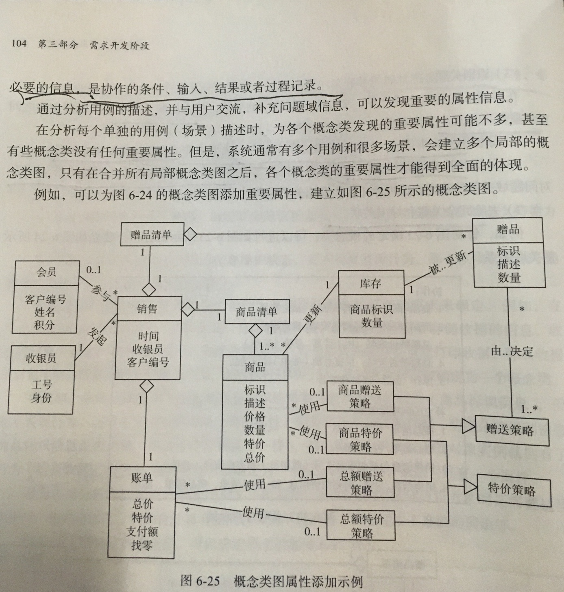

## 顺序图的画法


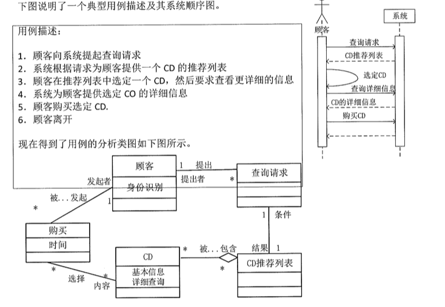


## 软件测试 :x:

无返回值方法的测试：

addSalesLineItem();

push();

Pop()